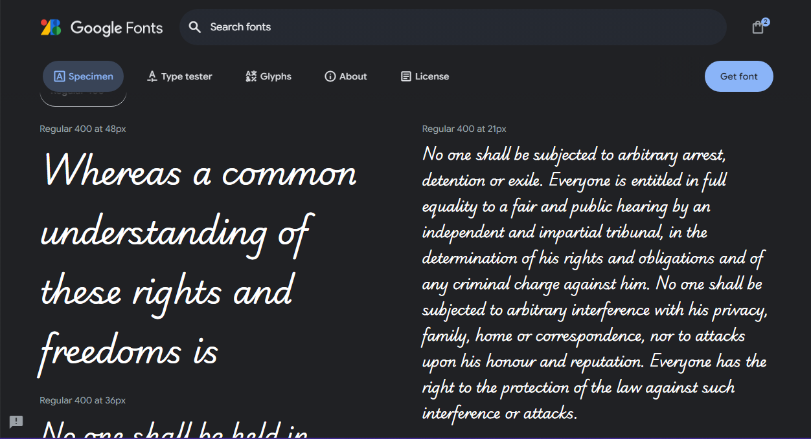
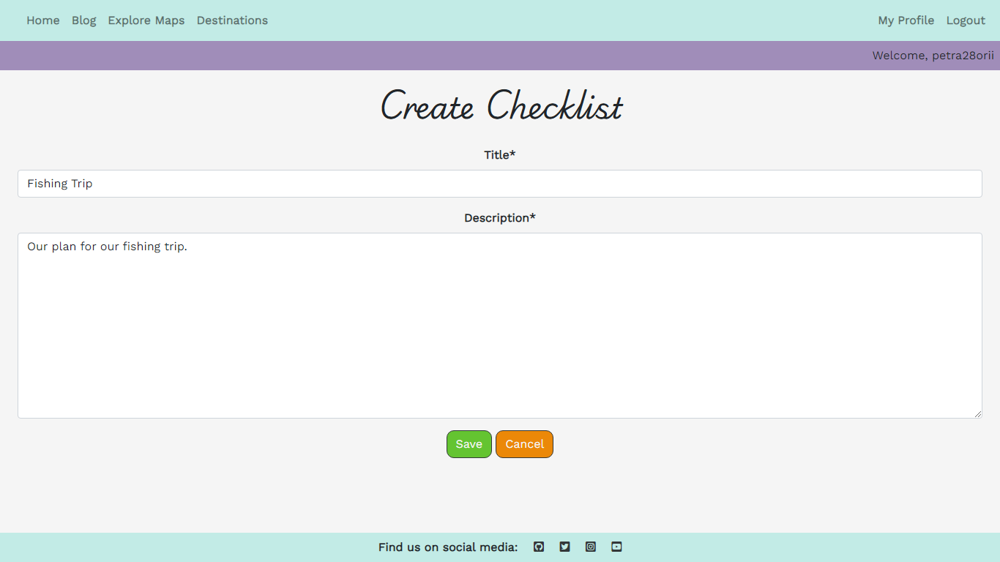

# Time[less] Travel

Time[less] Travel is a travel blog/website designed to help travelers achieve their dream holidays and to comemorate them afterwards! This website is aiming to help travelers gather all the travel research into a single space, where they can create travel prep checklists, write blog posts about their travels, and much more! The website has a seamless UX design, allowing users to focus on their content and plans in a secure way.

# Table of Contents

1. **[Project Goals](#project-goals)**
2. **[Target Audience](#target-audience)**
3. **[Design](#design)**
    * [Typography](#typography)
    * [Color Scheme](#color-scheme)
4. **[Features](#features)**
    * [Existing Features](#existing-features)
        + [User Profile](#user-profile)
        + [Blog Posts](#blog-posts)
        + [Checklists and Tasks](#checklists-and-tasks)
            * [Progress Tracking](#progress-tracking)
        + [User Authentication](#user-authentication)
            * [Sign Up Page](#sign-up-page)
            * [Sign In Page](#sign-in-page)
            * [Reset Password Feature](#reset-password-feature)
    * [Future Implementations](#future-implementations)
5. **[Technologies](#technologies)**
6. **[Deployment and Local Development](#deployment-and-local-development)**
    * [Deployment](#deployment)
    * [Local Development](#local-development)
7. **[Testing](#testing)**
8. **[Credits](#credits)**
9. **[Acknowledgements](#acknowledgements)**

# Project Goals
# Target Audience
# Design

## Typography

I used Google Fonts for typography. My choice of fonts was **Playwrite AU SA** for main headings and titles:

For the rest of the webpage, I used **Work Sans** font:

## Color Scheme

I went with a pretty rich color scheme, specifically I used strong colors for the CRUD buttons, because they emphasize the effect these actions can have on a user's data.

The pastel colors are used for the navbar and the direction buttons, since there are many colorful photos and the main focus should be on these photos rather than on the colors, hence the pastel colors complement the photos in an elegant way.

## Imagery

I used photos from [Pexels](https://pexels.com) for the blog posts, the hero image is a photo taken by me. These photos are all related to travelling and well-known destinations.

# Features

## Existing Features

### User Profile

The moment they are registered, the website automatically creates a profile for them. They can easily access it in the upper-right side of the navbar. In their profile, they can upload their own profile picture, and update their bio with a few words about themselves. 

On their profile page, they can go and check their draft posts as well. More information on draft posts is found below in the [Blog Posts](#blog-posts).

At the bottom of the profile, there are two sections: on the left side, the *Checklists* section, which contains their own personal checklists (only the users themselves are able to see them) and on the right side, the *Posts* section, which contains all of their published posts.

### Blog Posts

Every user that registers for an account can start writing blog posts to share their experiences and to give advice to those that are seeking to travel. The main blog page consists of a list of all blog posts, ordered from *Newest* to *Oldest*. In the main blog page, every post has a title, the author and an excerpt to offer a little preview into the story. The user can click on any post to read it and/or leave a comment. Users can create, edit or delete their own posts.

When creating a post, users need to add:

* **Title** - Title of the blog post
* **Content** - The content of the blog post
* **Status** - User can save the post as a *Draft* or *Published*
* **Excerpt** - A short introduction offering a preview of the post
* **Featured Image** - An image from the said destination
* **Visibility** - Who can see this post

Posts that are saved as drafts can be accessed on the user's profile page, where they can further edit (or even delete, if they change their mind) their posts and choose to publish them.

Users can set their posts to a few visibility options:

* *Private* - Only the authors can see this post
* *Users Only* - Only registered users can see this post
* *Public* - Everyone can see this post

### Checklists and Tasks

As a registered user, one can create multiple checklists to separate their tasks. Checklists are intuitive to navigate, at the right of the checklist the user can check to see how many tasks are completed how many are still pending. Inside the checklist, users have a list of tasks that can easily edited and checked as complete. Both checklists and tasks have CRUD functionalities, giving the user freedom to create, edit and delete their checklists.

Checklists are located in the lower-left section of a user's profile. There are two different colored circles beside every checklist with a certain number in them. The green circle is giving the user the number of tasks completed within the checklist, whilst the red circle is showing the remaining tasks left to be completed.

User can easily access a checklist by clicking on the title:

Clicking on the `Create Checklist` button will prompt the user to a form:

Once inside the checklist, the user can see a list of tasks. Every task has a title, a priority level (Options are: `Low`, `Medium`, `High`), a button to toggle task completion and an `Edit` button. 

This template also has CRUD functionalities. The user can add tasks, edit or delete the checklist, and they go back to their profile page as well.

Like with checklists, the user can add a task:

Edit the task: 

If the user wants to delete a task (or checklist), they will asked to confirm before permanently deleting the task:

#### Progress Tracking

Below the list of tasks, there is a progress bar that updates dynamically as the user completes these tasks. When there are no tasks completed, the bar is empty:

When a user completes a task, the progress bar is updated:

As the user progresses through their tasks, the bar updates, giving the user a positive feeling of 'getting things done'. The `Pending` button also changes its color from red to green, and the text will read `Completed`. In case it was wrongfully clicked, the user can always undo by clicking again on the `Completed` button to turn it back to `Pending`.

### User Authentication

One of the basic features this website has is user authentication. In order for the user to make the most out of the website's functionalitites, they must create an account.

#### Sign Up Page

The sign up form was thoroughly tested and validated. User needs to input their first and last names, respectively, alongside with their email address, username and a strong password. After the form is submitted, the user is successfully registered. 

#### Sign In Page

For a returning user, there is a sign in page. In the eventuality they forget their password, they can easily click on the *"Forgot Password?"* link to get their password reset.

#### Reset Password Feature

Users can reset their password by inputting their email address. Shortly after they'll receive an email from the website with a link, prompting them to a new tab to reset their password.

## Future Implementations

# Technologies
# Deployment and Local Development

## Deployment

1. Log in to **[Heroku](https://www.heroku.com/)** if you already have an account with them. If not, **[create an account](https://signup.heroku.com/)**.
2. Once signed in, click on the "**Create New App**" button located above your dashboard. Give your app a unique name, choose the region you're in (United States/Europe) and click "**Create app**".
3. Before deploying, you need to go to the **Settings** tab. Once there, scroll down and click on **Reveal Config Vars** to open this section.
4. In this section, enter all of your environment variables that are present in your `env.py` file. Fields like `DATABASE_URL`, `SECRET_KEY`, `CLOUDINARY_URL` (*if using Cloudinary*), `EMAIL_HOST_USER` and `EMAIL_HOST_PASSWORD` if you are planning on sending emails to users (like having a *Reset Password* functionality).
5. After that, make sure to go to the **Resources** tab and make sure Heroku didn't automatically set up a database for you. If that happens, simply remove the PostgreSQL database.
6. Now, go to the **Deploy** tab. Once there, in the **Deployment Method** section, click `GitHub` and if needed, authorize `GitHub` to access your `Heroku` account. Click **Connect to GitHub**.
7. Once connected, look up your GitHub repository by entering the name of it under **Search for a repository to connect to** and click **Search**. After you've found your repo, click **Connect**. 
8. Now, you can click on **Enable Automatic Deploys** (optional, but I'd recommend it to save time and to detect any issues should they arise), and then select **Deploy Branch**. *If you enabled automatic deploys, every time you push changes to GitHub, the app will be automatically deployed every time, just like you would with a webpage deployed on GitHub Pages*.
9. The app can take a couple of minutes until it's deployed. Once it's done, you'll see the message **Your app was successfully deployed** and a **View** button will come up where you can see your deployed app. 

## Local Development

### How to Clone
1. Log into your account on GitHub
2. Go to the repository of this project /petra66orii/timeless-travel/
3. Click on the code button, and copy your preferred clone link
4. Open the terminal in your code editor and change the current working directory to the location you want to use for the cloned directory
5. Type 'git clone' into the terminal, paste the link you copied in step 3 and press enter

### How to Fork
To fork the repository:
1. Log in (or sign up) to Github.
2. Go to the repository for this project, petra66orii/timeless-travel
3. Click the Fork button in the top right corner

# Testing
# Credits
# Acknowledgements