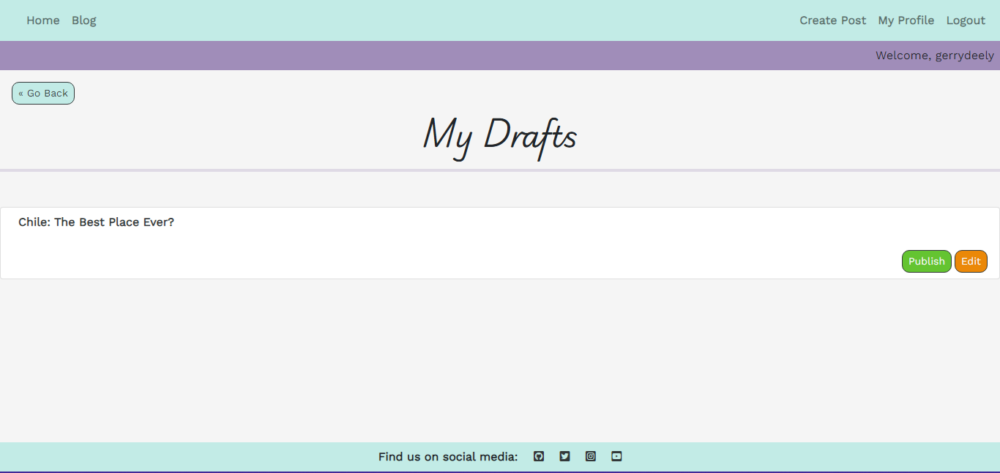
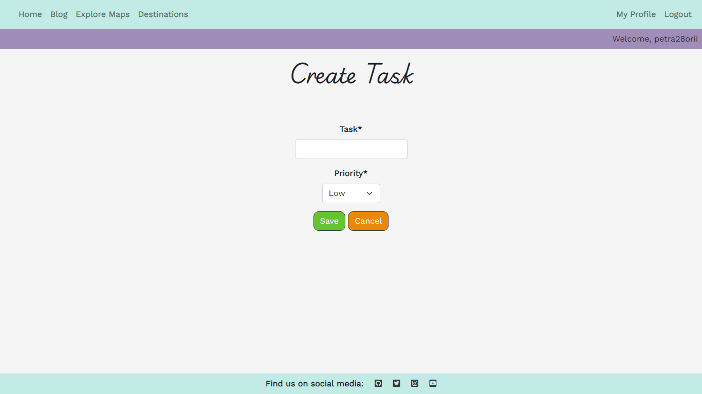

# Time[less] Travel

Time[less] Travel is a travel blog/website designed to help travelers achieve their dream holidays and to comemorate them afterwards! This website is aiming to help travelers gather all the travel research into a single space, where they can create travel prep checklists, write blog posts about their travels, and much more! The website has a seamless UX design, allowing users to focus on their content and plans in a secure way. Holiday planning can be a bit of a pain, but with the right digital tools, planning becomes enjoyable!

# Table of Contents

1. **[Project Goals](#project-goals)**
    * [Workflow](#workflow)
    * [Data Schema](#data-schema)
        + [BlogPost Model](#blogpost-model)
        + [Comment Model](#comment-model)
        + [Checklist Model](#checklist-model)
        + [Task Model](#task-model)
        + [Profile Model](#profile-model)
2. **[Target Audience](#target-audience)**
3. **[Design](#design)**
    * [The Five Planes of UX](#the-five-planes-of-ux)
        + [Strategy](#strategy)
        + [Scope](#scope)
        + [Structure](#structure)
        + [Skeleton](#skeleton)
        + [Surface](#surface)
    * [Wireframes](#wireframes)
        + [Home Page](#home-page)
        + [Blog Page](#blog-page)
        + [Profile Page](#profile-page)
        + [Checklist Page](#checklist-page)
        + [Post Page](#post-page)
    * [Typography](#typography)
    * [Color Scheme](#color-scheme)
4. **[Features](#features)**
    * [Existing Features](#existing-features)
        + [Navbar](#navbar)
        + [Home Page](#home-page)
        + [User Profile](#user-profile)
        + [Blog Posts](#blog-posts)
            * [Comments](#comments)
        + [Draft Posts](#draft-posts)
        + [Checklists and Tasks](#checklists-and-tasks)
            * [Progress Tracking](#progress-tracking)
        + [User Authentication](#user-authentication)
            * [Sign Up Page](#sign-up-page)
            * [Sign In Page](#sign-in-page)
            * [Reset Password Feature](#reset-password-feature)
    * [Future Implementations](#future-implementations)
5. **[Technologies](#technologies)**
6. **[Deployment and Local Development](#deployment-and-local-development)**
    * [Deployment](#deployment)
    * [Local Development](#local-development)
7. **[Testing](#testing)**
    * [Validation](#validation)
        * [W3C Validator](#w3c-validator)
        * [Jigsaw CSS Validator](#jigsaw-css-validator)
        * [JS Hint](#jshint)
        * [PEP8](#pep8)
        * [Wave Accessibility](#wave-accessibility)
        * [Lighthouse Report](#lighthouse-report)
    * [Manual Testing](#manual-testing)
    * [Fixed Bugs](#fixed-bugs)
        * [Bug #1 - Blog Link Wouldn't Work](#bug-1-blog-link-wouldnt-work)
        * [Bug #2 - User Profile Wouldn't Load](#bug-2-user-profile-wouldnt-load)
        * [Bug #3 - User Couldn't Log In](#bug-3---user-couldnt-log-in)
        * [Bug #4 - User Profile Wasn't Automatically Created](#bug-4---user-profile-wasnt-automatically-created)
        * [Bug #5 - `Home` Link](#bug-5---home-link)
        * [Bug #6 - No Confirmation Messages for Deleting Messages](#bug-6---no-confirmation-messages-for-deleting-messages)
        * [Bug #7 - Everyone Can See Everyone's Checklists](#bug-7---everyone-can-see-everyones-checklists)
        * [Bug #8 - `Cancel` Button Would Redirect Too Far Back](#bug-8---cancel-button-would-redirect-too-far-back)
        * [Bug #9 - `Add Task` Button Wasn't Working](#bug-9---add-task-button-wasnt-working)
        * [Bug #10 - Error Loop Would Cause The `Create Task` Template to Crash](#bug-10---error-loop-would-cause-the-create-task-template-to-crash)
        * [Bug #11 - Blog Posts Weren't Showing Up](#bug-11---blog-posts-werent-showing-up)
        * [Bug #12 - Double Display of Messages](#bug-12---double-display-of-messages)
8. **[Credits](#credits)**
    * [Code Used](#code-used)
    * [Content](#content)
9. **[Acknowledgements](#acknowledgements)**

# Project Goals

The main goal for this website is to enable travellers to share their experiences when travelling while at the same time be able to plan their next holiday, all in one place. It is intuitive to navigate, with a seamless UX, designed in a simple, yet colorful website.

## Workflow 

This project was planned using the Agile Methodology. Features were grouped into **EPICS** (*Milestones* on `Github`), which in turn contain **USER STORIES** (*Issues* on `Github`), which also contained *Tasks* and *Acceptance Criteria* to ensure the features were implemented most efficiently.

The project Kanban can be seen [here](https://github.com/users/petra66orii/projects/2)

Users can do the following:

* Create travel checklists: [EPIC: Checklists](https://github.com/petra66orii/timeless-travel/milestone/2?closed=1)
* Create a profile: [EPIC: User Profiles](https://github.com/petra66orii/timeless-travel/milestone/6?closed=1)
* Create blog posts: [EPIC: Blog Posts](https://github.com/petra66orii/timeless-travel/milestone/3?closed=1)

## Data Schema 

Planning for the database involved creating an ERD diagram to see the relationships between the data models:

The application uses a relational database to store and manage data. Below is the data schema:

### BlogPost Model

**Fields**:
* `*author*`: `*ForeignKey*` to the `*User*` model (*Relation*: one user can author many blog posts).
* `*title*`: CharField (max_length=255) - the title of the blog post.
* `*slug*`: SlugField (max_length=255) - unique identifier for the post URL.
* `*content*`: TextField - the content of the blog post.
* `*created_at*`: DateTimeField - timestamp when the post is created.
* `*updated_at*`: DateTimeField - timestamp when the post is last updated.
* `*status*`: IntegerField - determines whether the post is draft or published.
* `*excerpt*`: TextField - short preview of the blog post.
* `*featured_image*`: CloudinaryField - stores an optional featured image for the post.
* `*visibility*`: CharField - determines if the post is public or private.

### Comments Model

**Fields**:
* `*post*`: `*ForeignKey*` to the `*BlogPost*` model (*Relation*: one post can have many comments).
* `*user*`: `*ForeignKey*` to the `*User*` model (*Relation*: one user can comment on multiple posts).
* `*content*`: TextField - the comment text.
* `*created_at*`: DateTimeField - timestamp when the comment is created.

### Checklist Model

**Fields**:
* `*user*`: `*ForeignKey*` to the `*User*` model (*Relation*: one user can have multiple checklists).
* `*description*`: CharField (max_length=255) - a description of the checklist.
* `*title*`: CharField (max_length=255) - title of the checklist.
* `*created_at*`: DateTimeField - timestamp when the checklist is created.
* `*updated_at*`: DateTimeField - timestamp when the checklist is last updated.

### Task Model

**Fields**:
* `*checklist*`: `*ForeignKey*` to the `*Checklist*` model (*Relation*: one checklist can have multiple tasks).
* `*task*`: CharField (max_length=255) - description of the task.
* `*completed*`: BooleanField - indicates if the task is completed.
* `*priority*`: CharField (choices: *low*, *medium*, *high*) - priority level of the task.

### Profile Model

**Fields**:
* `*user*`: `*OneToOneField` to the `*User*` model (*Relation*: one user has one profile).
* `*bio*`: TextField - user's biography or about information.
* `*profile_picture*`: CloudinaryField - optional field for storing a profile picture.

**Relationships**:

* `*BlogPost*` -> `*Comments*`: *One-to-Many* relationship.
* `*Checklist*` -> `*Task*`: *One-to-Many* relationship.
* `*User*` -> `*BlogPost*`, `*Checklist*`, `*Comments*`, `*Profile*`: *One-to-Many* or *One-to-One* relationships.

# Target Audience

This website is targeted at people who are seasoned travellers, as they can make use of many helpful tools to organize their perfect holiday. 

At the same time, people that haven't travelled that much, but still have an innate curiosity to explore the world can also find this website very helpful in making that big step when it comes to travelling, as they can read other user's blog posts that can contain useful information about where to go and what is best way to spend money while still enjoying the most of the place that's visited

# Design

## The Five Planes of UX

The five planes of UX are *Strategy*, *Scope*, *Structure*, *Skeleton*, and *Surface*. They provide a systematic framework for understanding how this travel website is designed to deliver value to users while achieving its overarching purpose. Here's how the utility of the travel website aligns with each plane:

### Strategy

Its purpose is to empower users to seamlessly organize their dream holidays while also enabling them to share their travel stories through blog posts.

*User Needs*:

It provides an intuitive way to simplify holiday planning by organizing checklists and tasks. It also offers a platform to discover travel inspiration and share personal tips, photos, and experiences with a like-minded community.

*Business Goals*:

* Build an engaged travel community by offering tools and features that make planning and storytelling easy and enjoyable.
* Differentiate from competitors by combining practical tools (like planners) with a personal, creative outlet (blogging).
* Increase user retention by creating a unique platform that caters to travelers at every stage of their journey — from planning to sharing.

### Scope

The core features of this website consist of:

+ *Holiday Planning*: Users can create, edit, and manage personalized checklists to organize their trips, e.g., packing lists, booking reminders, or destination-specific tasks.

+ *User-Generated Content*:
* **Blog Posts**: Users can write and publish blog posts to document their travel experiences, complete with photos and tags.
* **Comments**: Foster interaction between users through comments on blogs.
* **User Profiles**: Enable users to view and manage their blog contributions, saved checklists, and preferences in a centralized profile.
* **Admin Features**: Tools to moderate blog content and comments to ensure a high-quality user experience.

*Planned Constraints*: Certain features, such as travel tips or advanced mapping integrations, may be postponed initially to focus on delivering a minimum viable product (MVP) within the project timeline.

### Structure

*Content Hierarchy*:

**Primary Navigation**: Includes the main sections such as Home, Travel Planner, Blog, and Profile.
**Secondary Navigation**: Access to admin features like moderation tools and dynamic category management.

**User Flows**:

*For holiday planning*:

* User logs in.
* Creates or edits a checklist with tasks like "Pack clothes," "Book flights," or "Research local attractions."
* Saves progress and revisits the checklist throughout the trip-planning process.

*For sharing travel stories*:

* User writes a blog post about a trip, uploads photos, and tags relevant places.
* Publishes the blog and interacts with comments from other users.

*Content relationships*:

* Blog posts are linked to comments and user profiles for an interconnected, community-driven experience.
* Checklists and individual tasks are grouped for streamlined holiday planning.

### Skeleton

*Navigation design*:

* A clean top navigation bar provides quick access to the website’s main sections: Home, Travel Planner, Blog, and Profile.
* Dropdowns or secondary menus may appear for admin or advanced features.

*Interface elements*:

**Forms**: Simple, user-friendly forms for tasks like:
* Creating/editing checklists.
* Writing blog posts with the ability to add media.
* Editing user profiles.

**Feedback mechanisms**:

* Users receive visual or textual feedback for key actions, e.g., "Task marked as completed!" or "Blog post published successfully."

**Progress indicators**:

* Checklists show a percentage or visual bar indicating completion status.

**Responsive design**:

* The website is designed to adapt seamlessly across devices, ensuring a smooth experience on desktops, tablets, and smartphones.

### Surface

**Design style**:

*Theme*: A modern and travel-inspired theme that captures the excitement of exploring new destinations. 
* Uses a combination of pastel tones and sky blues to evoke calm and relaxation.
* Vibrant imagery of landmarks, landscapes, and cultural elements to inspire wanderlust.

*Typography*: Clean, approachable fonts with a slightly adventurous feel (e.g., sans-serif for modernity and serif for warmth).

*Imagery*: High-quality photos and illustrations of travel destinations to spark curiosity.

**Emotional impact**:

* Creates a sense of adventure and excitement while making trip planning feel effortless and organized.
* Promotes community interaction by fostering a welcoming, inclusive, and visually appealing environment.

## Wireframes

For UX design, wireframes were created:

### Home Page

### Blog Page

### Profile Page

### Checklist Page

### Post Page

## Typography

I used Google Fonts for typography. My choice of fonts was **Playwrite AU SA** for main headings and titles:

For the rest of the webpage, I used **Work Sans** font:

## Color Scheme

I went with a pretty rich color scheme, specifically I used strong colors for the CRUD buttons, because they emphasize the effect these actions can have on a user's data.

The pastel colors are used for the navbar and the direction buttons, since there are many colorful photos and the main focus should be on these photos rather than on the colors, hence the pastel colors complement the photos in an elegant way.

## Imagery

I used photos from [Pexels](https://pexels.com) for the blog posts, the hero image is a photo taken by me. These photos are all related to travelling and well-known destinations.

# Features

## Existing Features

### Navbar

The navbar is at the top of the website at all times. The links dynamically change depending on login status and the user has a little bar under the navbar that tells them whether they're logged in or not:

### Home Page

The home page is a fairly simple one, with a hero image (*Fun Fact: That is at the top of Roys Peak in New Zealand!*) and has a reviews section at the bottom:

### User Profile

The moment they are registered, the website automatically creates a profile for them. They can easily access it in the upper-right side of the navbar. In their profile, they can upload their own profile picture, and update their bio with a few words about themselves. 

On their profile page, they can go and check their draft posts as well. More information on draft posts is found below in the [Blog Posts](#blog-posts).

At the bottom of the profile, there are two sections: on the left side, the *Checklists* section, which contains their own personal checklists (only the users themselves are able to see them) and on the right side, the *Posts* section, which contains all of their published posts.

### Blog Posts

Every user that registers for an account can start writing blog posts to share their experiences and to give advice to those that are seeking to travel. The main blog page consists of a list of all blog posts, ordered from *Newest* to *Oldest*. In the main blog page, every post has a title, the author and an excerpt to offer a little preview into the story. The user can click on any post to read it and/or leave a comment.

Users can create, edit or delete their own posts.

Users also can make use of Summernote's rich text editor, which was implemented within the post creation form.

When creating a post, users need to add:

* **Title** - Title of the blog post
* **Content** - The content of the blog post
* **Status** - User can save the post as a *Draft* or *Published*
* **Excerpt** - A short introduction offering a preview of the post
* **Featured Image** - An image from the said destination
* **Visibility** - Who can see this post

#### Comments

Users can add comments to blog posts only if they're registered and logged in. They can also edit and/or delete them as well.

### Draft Posts

Posts that are saved as drafts can be accessed on the user's profile page, where they can further edit (or even delete, if they change their mind) their posts and choose to publish them.

After the user publishes the draft:

Users can set their posts to a few visibility options:

* *Private* - Only the authors can see this post
* *Users Only* - Only registered users can see this post
* *Public* - Everyone can see this post

### Checklists and Tasks

As a registered user, one can create multiple checklists to separate their tasks. Checklists are intuitive to navigate, at the right of the checklist the user can check to see how many tasks are completed how many are still pending. Inside the checklist, users have a list of tasks that can easily edited and checked as complete. Both checklists and tasks have CRUD functionalities, giving the user freedom to create, edit and delete their checklists.

Checklists are located in the lower-left section of a user's profile. There are two different colored circles beside every checklist with a certain number in them. The green circle is giving the user the number of tasks completed within the checklist, whilst the red circle is showing the remaining tasks left to be completed.

User can easily access a checklist by clicking on the title:

Clicking on the `Create Checklist` button will prompt the user to a form:

Once inside the checklist, the user can see a list of tasks. Every task has a title, a priority level (Options are: `Low`, `Medium`, `High`), a button to toggle task completion and an `Edit` button. 

This template also has CRUD functionalities. The user can add tasks, edit or delete the checklist, and they go back to their profile page as well.

Like with checklists, the user can add a task:

Edit the task: 

If the user wants to delete a task (or checklist), they will asked to confirm before permanently deleting the task:

#### Progress Tracking

Below the list of tasks, there is a progress bar that updates dynamically as the user completes these tasks. When there are no tasks completed, the bar is empty:

When a user completes a task, the progress bar is updated:

As the user progresses through their tasks, the bar updates, giving the user a positive feeling of 'getting things done'. The `Pending` button also changes its color from red to green, and the text will read `Completed`. In case it was wrongfully clicked, the user can always undo by clicking again on the `Completed` button to turn it back to `Pending`.

### User Authentication

One of the basic features this website has is user authentication. In order for the user to make the most out of the website's functionalitites, they must create an account.

#### Sign Up Page

The sign up form was thoroughly tested and validated. User needs to input their first and last names, respectively, alongside with their email address, username and a strong password. After the form is submitted, the user is successfully registered. 

#### Sign In Page

For a returning user, there is a sign in page. In the eventuality they forget their password, they can easily click on the *"Forgot Password?"* link to get their password reset.

#### Reset Password Feature

Users can reset their password by inputting their email address. Shortly after they'll receive an email from the website with a link, prompting them to a new tab to reset their password.

## Future Implementations

There were so many things I would've wanted to implement in addition to what already is existent. For instance:
* Interactive maps with the ability to save routes
* A budget tracker
* Search and filter functionalities
* Change username
* Timeline of previous holidays with image uploading and tags

# Technologies

- **Django**: Web framework for backend development, which provided a structured approach to building this website.
- **PostgreSQL**: Database management system for storing and managing blog posts, checklists and tasks data securely.
- **Cloudinary**: Cloud-based image and video management service used for handling images of destinations all over the world.
- **HTML/CSS/JavaScript**: Frontend technologies for creating interactive and responsive user interfaces.
- **Bootstrap**: Frontend framework for designing mobile-first and responsive websites.
- **Git/GitHub**: Version control system and platform for project management.
- **Heroku**: Cloud platform for deploying the application.
- **GitPod**: Online IDE for coding and devloping project.
- **PEP8**: Python style guide used to ensure code readability and consistency.
- **WAVE Accessibility Tool**: Web accessibility evaluation tool for ensuring accessibility inclusive design practices.
- **W3C Validator**: Tools for validating HTML, CSS, and web standards used in website development.
- **dbdiagram.io**: ERD design.
- **Pexels**: Royalty free images.
- **Balsamiq**: Wireframe building app.

# Deployment and Local Development

## Deployment

1. Log in to **[Heroku](https://www.heroku.com/)** if you already have an account with them. If not, **[create an account](https://signup.heroku.com/)**.
2. Once signed in, click on the "**Create New App**" button located above your dashboard. Give your app a unique name, choose the region you're in (United States/Europe) and click "**Create app**".
3. Before deploying, you need to go to the **Settings** tab. Once there, scroll down and click on **Reveal Config Vars** to open this section.
4. In this section, enter all of your environment variables that are present in your `env.py` file. Fields like `DATABASE_URL`, `SECRET_KEY`, `CLOUDINARY_URL` (*if using Cloudinary*), `EMAIL_HOST_USER` and `EMAIL_HOST_PASSWORD` if you are planning on sending emails to users (like having a *Reset Password* functionality).
5. After that, make sure to go to the **Resources** tab and make sure Heroku didn't automatically set up a database for you. If that happens, simply remove the PostgreSQL database.
6. Now, go to the **Deploy** tab. Once there, in the **Deployment Method** section, click `GitHub` and if needed, authorize `GitHub` to access your `Heroku` account. Click **Connect to GitHub**.
7. Once connected, look up your GitHub repository by entering the name of it under **Search for a repository to connect to** and click **Search**. After you've found your repo, click **Connect**. 
8. Now, you can click on **Enable Automatic Deploys** (optional, but I'd recommend it to save time and to detect any issues should they arise), and then select **Deploy Branch**. *If you enabled automatic deploys, every time you push changes to GitHub, the app will be automatically deployed every time, just like you would with a webpage deployed on GitHub Pages*.
9. The app can take a couple of minutes until it's deployed. Once it's done, you'll see the message **Your app was successfully deployed** and a **View** button will come up where you can see your deployed app. 

## Local Development

### How to Clone
1. Log into your account on GitHub
2. Go to the repository of this project /petra66orii/timeless-travel/
3. Click on the code button, and copy your preferred clone link
4. Open the terminal in your code editor and change the current working directory to the location you want to use for the cloned directory
5. Type 'git clone' into the terminal, paste the link you copied in step 3 and press enter

### How to Fork
To fork the repository:
1. Log in (or sign up) to Github.
2. Go to the repository for this project, petra66orii/timeless-travel
3. Click the Fork button in the top right corner

# Testing

## Validation

The `Sign In` and `Sign Up` forms have validation with clear feedback to user:

Also a user can't reset a password with an invalid email address:

### W3C Validator

Here I'm displaying a few of the templates tested because there is a large number of templates. All templates passed the W3C Validator with no errors:

### Jigsaw CSS Validator

Passed the Jigsaw CSS Validator with flying colors:

### JSHint

All of the JavaScript scripts passed with no errors:

 
 
 
 

### PEP8

[Pep8 CI](https://pep8ci.herokuapp.com/) linter was used, the results are as follows:

| App            | File                 | CI Linter Result           |
|----------------|----------------------|----------------------------|
| blog           | admin.py             | All clear, no errors found |
|                | apps.py              | All clear, no errors found |
|                | forms.py             | All clear, no errors found |
|                | test_forms.py        | All clear, no errors found |
|                | models.py            | All clear, no errors found |
|                | urls.py              | All clear, no errors found |
|                | views.py             | All clear, no errors found |
| checklists     | admin.py             | All clear, no errors found |
|                | apps.py              | All clear, no errors found |
|                | forms.py             | All clear, no errors found |
|                | test_forms.py        | All clear, no errors found |
|                | models.py            | All clear, no errors found |
|                | urls.py              | All clear, no errors found |
|                | views.py             | All clear, no errors found |
| home           | apps.py              | All clear, no errors found |
|                | urls.py              | All clear, no errors found |
|                | views.py             | All clear, no errors found |
| user_profiles  | admin.py             | All clear, no errors found |
|                | apps.py              | All clear, no errors found |
|                | forms.py             | All clear, no errors found |
|                | test_forms.py        | All clear, no errors found |
|                | models.py            | All clear, no errors found |
|                | signals.py           | All clear, no errors found |
|                | urls.py              | All clear, no errors found |
|                | views.py             | All clear, no errors found |

### Wave Accessibility

The pages also passed the Wave Test successfully:

### Lighthouse Report

Lighthouse reports came out with a good score:

## Manual Testing

|Test Item|Test Carried Out|Expected Outcome|Result|Pass/Fail|
|-------------|------------------|------------------|-------------------|-------|
|**Sign Up Page**|Inputting details and click on *Sign Up* button|User should be signed up and redirected to *Home Page* with feedback from the webpage|User is redirected as expected, and received two messages: `You have successfully registered! Welcome to Time[less] Travel!` and `Successfully signed in as [username]`, welcoming them to the platform|PASS|
||Attempting signing up with an empty field|Form should highlight the empty field and not sign up the account|The empty field is highlighted and displays `Please fill out this field`|PASS|
||Hover over popover toggle (the little purple question mark)|When hovered over, the popover toggle displays password validation rules|A little window pops up and displays password validation rules|PASS|
||`Your password can't be too similar to your other personal information`|Typing a password (`testing22`) resembing the username (`testing2`) and email address (`testing2@yahoo.com`) should stop the sign up process|User is not allowed to sign up and receives feedback accordingly (See [Validation](#validation) above)|PASS|
||`Your password must contain at least 8 characters`|Typing a password shorter than 8 characters should stop the sign up process|User is not allowed to sign up and receives feedback accordingly (See [Validation](#validation) above)|PASS|
||`Your password can't be a commonly used password`|Typing a common password like... `password`. The sign up process is stopped|User is not allowed to sign up and receives feedback accordingly (See [Validation](#validation) above)|PASS|
||`Your password can't be entirely numeric`|Typing a fully numeric password, `1234567890` should fail the sign up process|User is not allowed to sign up and receives feedback accordingly (See [Validation](#validation) above)|PASS|
||`Sign In` link redirects to sign in template|If user clicks on the *sign in* link above the sign up form, they should be redirected to the *sign in* page|User is redirected as expected|PASS|
|             |                   |                    |               |              |
|**Sign In Page**|Inputting details and click on *Sign In* button|User should be signed up and redirected to *Home Page* with feedback from the webpage|User is redirected as expected, and received the message: `Successfully signed in as [username]`, welcoming them to the platform|PASS|
||Enter the wrong password/username|Input is not accepted. The message `The username and/or password you specified are not correct.` should show up and prompt them to input their correct details.|User receives appropriate feedback and the form reloads.|PASS|
||`Sign Up` link redirects to sign up template|If user clicks on the *sign up* link above, they should be redirected to the *sign up* page|User is redirected as expected|PASS|
|             |                   |                    |               |              |
|**Reset Password**|`Forgot Password?` link redirects the user to reset password|User is redirected to said page, where they are required to input their email address so that they can receive a link which will prompt them to reset their password|User is redirected as expected|PASS|
||Input an invalid email address|Input should not be accepted|Input is not accepted. The message `Enter a valid email address.` appears and prompts the user to enter the email address again (See [Validation](#validation) above)|PASS|
||User receives email from Time[less] Travel|User should receive an email with a link from the website prompting them to reset their password|User receives reset password link through an email|PASS|
|             |                   |                    |               |              |
|**Navigation Bar**|*Home* link brings the user to the main page|User should be redirected to *Home* page|User is redirected to home page, and the *Home* link is highlihted to express that|PASS|
||*Blog* link brings the user to the blog page|User should be redirected to *Blog* page|User is redirected to blog page, and the *Blog* link is highlihted to express that|PASS|
||*Login* link brings the user to the *sign in* page|User should be redirected to *Login* page|User is redirected to login page, and the *Login* link is highlihted to express that|PASS|
||*Register* link brings the user to the *register* page|User should be redirected to *Register* page|User is redirected to sign up page, and the *Register* link is highlihted to express that|PASS|
||Navbar changes its links when a user is registered|*Login* and *Register* are changed to *My Profile* and *Logout*, respectively when the user is logged in, and a new *Create Post* link is next to *My Profile*|Registered users have different navbar links than unregistered users|PASS|
||*Create Post* button|User should be redirected to a `create post` form|Link works as expected|PASS|
||Login status information|Under the navbar, the user should see one of two messages, depending on whether they are logged in or not: `Welcome, traveller! Please log in` or `Welcome, [username]`|When the user is logged in, the message is `Welcome, [username]`. Otherwise, the message displayed is: `Welcome, traveller! Please log in`|PASS|
|             |                   |                    |               |              |
|**My Profile**|Profile picture upload|User should be able to upload a photo as their profile picture|Image is uploaded as expected|PASS|
||Delete profile picture|User can delete their profile picture|The picture is removed successfully and a placeholder image appears instead|PASS| 
||Update bio|User can add text to their bio|Bio is shown in the profile page|PASS|
||*Cancel* button|User should go back to the profile page without any changes|Button works as expected|PASS|
||*Your Drafts* button|Should redirect the user to the *Drafts* page|User is successfully redirected to the *Drafts* page|PASS|
||Draft title link|When the user clicks on the draft title, they should be redirected to the post page|The link works as expected|PASS|
||*Edit* button|When the user clicks on the *Edit* button, they should be redirected to the post editing template|The user is redirected as expected|PASS|
||*Publish* button|When this button is pushed, the post disappears from the drafts list and is instead posted in the *Blog* page|The button works as expected|PASS|
||*Checklist Section* title link|The user clicks on the checklists' title to be redirected inside the checklist page|The link works as expected|PASS| 
||*Posts Section* title link|The user clicks on the posts' title to be redirected inside the blog post page|The link works as expected|PASS|
|**Checklists**|*Create Checklist* button|User should be redirected to a form where they can enter a title and a description|Form is working as expected|PASS|
||Numbers on the right-hand side of the checklist|Should display number of completed and pending tasks, respectively and it dynamically changes on task completion and viceversa|The numbers change as expected|PASS|
||*Add Task* button|User is redirected to a form where they input a title and a level of priority|Button works as expected|PASS|
||*Update* button|The user should be able to update the checklist's title and description|Checklist is successfully updated|PASS|
||*Delete* button|When the user clicks on the *Delete* button, they should be asked to confirm their decision and then the checklist is deleted|Checklist is deleted after confirmation|PASS|
||*Back to Profile* button|Should redirect user back to the profile page|Works as expected|PASS|
||Toggle task completion|When the user clicks on *Complete*, the task is marked as complete|Works as expected|PASS|
||Undo task completion|When the user clicks on *Undo*, the task is unmarked as complete|Works as expected|PASS|
||Progress bar updates dynamically|The progress bar is changing width and color when a task is completed or undone|The progress bar works as expected|PASS|
||*Edit* task button|Should be redirected to a prefilled form to update task|Button works as expected|PASS|
||*Delete* task button|Should be asked to confirm task deletion|Button works as expected and the task is deleted|PASS|
|**Blog Posts Page**|Click *here* link|Should be redirected to a `create post` form|Link works as expected|PASS|
||Blog posts title links|When clicked, it should redirect the user to the post detail page|Link works as expected|PASS|
||*Go Back* button|When clicked, it should redirect back to the main blog posts page|Button works as expected|PASS|
||*Edit Post* button is visible to author only|Button should only be visible to the author of the post|Another user can't see that button on that post|PASS|
||*Edit Post* button|When clicked, it redirect the user to a prefilled form and user is able to edit|Button works as expected|PASS|
||*Cancel* button|User should go back to the post detail page without any changes|Button works as expected|PASS|
||*Delete* button|User should be asked to confirm if they want to delete a post|Button works, deletion is confirmed, post is deleted|PASS|
|**Comment Section**|*Post Comment* button|User can type a comment in the text field and post a comment|Button works as expected|PASS|
||*Edit* and *Delete* buttons are only visible to the author of the comment|Logging in into a different account should make the buttons invisible|It works as expected|PASS|
||*Edit* comment button|Should fill up the text field with the comment and the *Post Comment* buttons changes to *Update*|Button works as expected|PASS|
||*Delete* comment button|Pressing this button should trigger a model box asking for confirmation|Button works, the modal pops up and the comment is afterwards deleted|PASS|
|**Footer**|*GitHub* icon|Redirects to [GitHub](https://github.com/petra66orii) in a new tab|Works as expected|PASS|
||*Twitter* icon|Redirects to [Twitter](https://www.twitter.com) in a new tab|Works as expected|PASS|
||*Instagram* icon|Redirects to [Instagram](https://www.instagram.com) in a new tab|Works as expected|PASS|
||*Youtube* icon|Redirects to [Youtube](https://www.youtube.com) in a new tab|Works as expected|PASS|
|**404 Page**|Invalid URL|Entering an invalid URL should redirect to a 404 page|Works as expected|PASS|
|**500 Page**|Server Error|Removing a website from `ALLOWED_HOSTS` should redirect to a 500 page|Works as expected|PASS|

## Fixed Bugs

Of course, since this was a very complex project, bugs were numerous as well. Thankfully, all bugs that appeared were fixed.

### Bug #1 - Blog Link Wouldn’t Work

When clicking on the `blog` link in the navbar nothing was happening.

* Solution: project-level `urls.py` was duplicated with `blog/urls.py`, which was "confusing" the server

### Bug #2 - User Profile Wouldn't Load 

User profile template wouldn't load when signing in.

* Solution: `user_profiles/urls.py` file had a mismatch in names; the *Base* template had ``, whereas the name parameter in `user_profiles/urls.py` was just `profile`.

### Bug #3 - User Couldn't Log In

Users would input their details but the website was throwing an error when clicking `Sign In`.

* Solution: There was a missing apostrophe within the form element, which affected the "POST" method as seen in the screenshot below:

### Bug #4 - User Profile Wasn't Automatically Created 

A user profile wasn't automatically created when a user would register as it was intended;

* *Solution*: There was an indentation error in `apps.py`, the `ready()` function wasn't indented to be part of `UserProfileConfig` class, and I also didn't have `__init.py__ ` set up. After rectifying this, everything worked as intended

### Bug #5 - `Home` Link 

The `Home` link in the navbar was highlighted as if it was active even when the user wouldn’t be on the home page

* *Solution*: Remove `active` class from navbar link

### Bug #6 - No Confirmation Messages for Deleting Messages  

Checklist would be deleted without any confirmation message showing up, even though there was a template linked to project

* *Solution*: form had method `POST`, instead of `GET`.

### Bug #7 - Everyone Can See Everyone's Checklists 

Checklists would be visible for all users, regardless of whether they created the checklist or not; This wasn’t intended like this as checklists and tasks are meant to be private for each user.

* *Solution*: Defined a function within `ChecklistDetailView` class that filters users; that way the users only get to see their own checklists

### Bug #8 - `Cancel` Button Would Redirect Too Far Back 

When clicking "Cancel" in the "Edit task" view, it would redirect me all the way back to the profile page instead of redirecting me to the respective checklist where the task was in; 

* *Solution*: Add `get_context_data` function in `TaskUpdateView` class and change the url in the template from `profile` to `checklist 'checklist.id'`

### Bug #9 - `Add Task` Button Wasn't Working 

When clicking on `Add task`, the page would fail to load;

* *Solution*: Add `get_context_data` function to `TaskCreateView` class

### Bug #10 - Error Loop Would Cause The `Create Task` Template to Crash

After fixing the `TaskCreateView` class, I was getting an error, but this time it was regarding the `*Delete*` button being present in the `create task` view. The `*Delete*` button was looking for an ID for a task that didn’t exist yet because the task itself wasn't created, which drove the website into an existential crisis; 

* *Solution*: Add a conditional statement in the `task_form` template to hide the `Delete` button when creating a task. 
* *Update*: Later on I’ve decided to create two separate templates for creating and editing tasks, respectively. I ended up doing the same for the checklists templates as well to avoid any confusion when rendering these templates.

### Bug #11 - Blog Posts Weren't Showing Up

Posts wouldn't appear on the blog list template, even though their visibility was set to 'Users Only' and I was logged in (not to mention I was the “author” of said posts).

* *Solution*: The `VISIBILITY` tuple had both lowercase and uppercase strings, and the database was reading the lowercase strings first, whilst in my `blog/views.py` function the uppercase strings were used; this is what was affecting filtering. By modifying the tuple accordingly, the posts are shown as intended.

### Bug #12 - Double Display of Messages 

After adding `success.messages` loop in the drafts template when publishing a post, the message would display twice. This is because I already had feedback messages displayed in the *Base* template.

* *Solution*: Add `suppress_messages` to `user_drafts` view and add conditional statement to the *Base* template.
* *Update*: Removed `suppress_messages` and left the messages conditional statement in the *Base* template exclusively to avoid repetition.

# Credits

## Code Used

Since this was a very complex project, I needed all the help I could muster. So I made extensive use of library documentation (especially Django's documentation) and various websites for the different issues I've encountered.

* [Creating a Slug in Django](https://stackoverflow.com/questions/837828/how-do-i-create-a-slug-in-django):
    * This was used for the `save()` function within the `BlogPost` model in the `blog` app to figure out how to generate slugs for posts in case it is not done automatically
* [Using Q for More Complex Queries](https://docs.djangoproject.com/en/4.2/topics/db/queries/#complex-lookups-with-q):
    * This was used in the `get_queryset()` (part of the `BlogPostList` class-based view) function in the `blog` app so I can filter out the posts in the **Blog** section based on them being published, whether they're *Private*, visible to *Users Only* and *Public*
* [`get_context_data` Function](https://docs.djangoproject.com/en/4.2/ref/class-based-views/mixins-single-object/#django.views.generic.detail.SingleObjectMixin.get_context_data):
    * Used this for multiple class-based views in the `blog` and `checklists` apps respectively to return context data for displaying the object
* [Class-Based Views](https://docs.djangoproject.com/en/4.2/ref/class-based-views/generic-editing/#django.views.generic.edit):
    * Used this to create class-based views in multiple apps like `blog` and `checklists`
    * The class-based views I've used are: `ListView`, `DetailView`, `CreateView`, `UpdateView`, `DeleteView`
* [Write Where the URL Is Being Redirected After Form Validation](https://docs.djangoproject.com/en/5.1/ref/class-based-views/mixins-editing/#django.views.generic.edit.ModelFormMixin.get_success_url)
* [Django Signals](https://www.guvi.in/blog/guide-for-django-signals-and-their-uses/):
    * I used this post to create Django signals that would direct the app to instantly create a user profile the moment a user registers on the website
* [Custom Sign Up Form](https://stackoverflow.com/questions/70809519/how-do-i-customize-django-allauth-sign-up-forms-to-look-the-way-i-want):
    * This StackOverflow thread helped to create and apply a custom sign up form that also included first and last names into the form
* [Django Paginator Class](https://docs.djangoproject.com/en/5.1/topics/pagination/):
    * Used Django's `Paginator` class to build pagination within the posts section in a user's profile
* [Bootstrap Documentation](https://getbootstrap.com/docs/5.3/getting-started/introduction/):
    * I made extensive use of Bootstrap's 5 documentation to make sure I was applying the most appropriate classes and to troubleshoot some of the more troublesome templates.
* [W3Schools - Bootstrap5](https://www.w3schools.com/bootstrap5/index.php):
    * Also used W3Schools' tutorial on Bootstrap5 for troubleshooting
    * Used this for the popover in the `Sign Up` page
    * Made use if it as well when coding a tooltip in the profile page
* [JavaScript fetch() API](https://www.geeksforgeeks.org/fetch-api/):
    * Used this article to write the `toggle-task-completion.js` script
* [Reset Password with Gmail](https://stackoverflow.com/questions/63435540/how-to-reset-password-using-django-and-gmail):
    * Used this article from StackOverflow to enable password resetting with the help of a Gmail account.
* [Change Email from `example.com` to `Time[less] Travel`](https://stackoverflow.com/questions/11372064/django-registration-how-do-i-change-example-com-in-the-email):
    * This thread came in handy when I was modifying the automatic email message from `example.com` to `Time[less] Travel`
* [Django Summernote Repo](https://github.com/lqez/django-summernote):
    * Setting up Summernote for blog posts was easier once I found its repository on GitHub
* [Django Forms](https://docs.djangoproject.com/en/4.2/topics/forms/):
    * Used to create class-based forms
* [Django Redirect to Previous Page](https://www.geeksforgeeks.org/django-redirect-to-previous-page-after-login/):
    * I needed as I had templates that would be accessed from different apps so I wanted the user to be able to go back to the previous page
* [Django Bleach](https://github.com/barseghyanartur/django-bleach):
    * Used `Bleach` to clean and secure the rich text editor
* [`stopPropagation()` JS Method](https://www.w3schools.com/jsref/event_stoppropagation.asp):
    * Used this to dismiss the feedback messages from having to click on the `X` button
* [Linking `Admin` to Front End](https://stackoverflow.com/questions/1022236/linking-to-the-django-admin-site):
    * Used this to add the `Admin` link to the navbar; it is only visible and it can only be accessed by the admin
* [Using Django's Built-In Template Tags](https://docs.djangoproject.com/en/4.2/ref/templates/builtins/#default):
    * Used it throughout the project to style the template tags

## Content

* A few images were taken from the royalty-free website [Pexels.com](https://pexels.com).
* Other photos are either mine or my family's photos.
* Placeholder image was taken from [here](https://commons.wikimedia.org/wiki/File:Profile_avatar_placeholder_large.png)

# Acknowledgements

* I would like to thank my partner Gerry for continously supporting me and offering.
* I would like to thank my entire family that signed up and tested out the website to ensure it's fully functional.
* I would like to thank my mentor Luke for his honest feedback and help in creating this project.